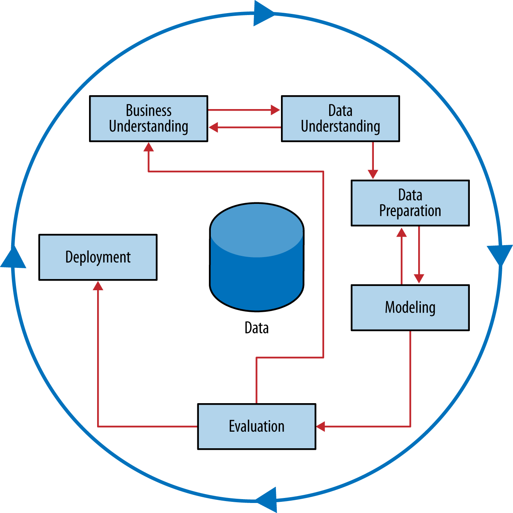

# Reducing Customer Churn of Telco

Telco company stakeholder have reached out to me for the solution of their recent surge in customer churn. This alarming trend is significantly impacting their long-standing relationship with their clients.

To solve this problem, they need a data scientist who can help them understand the underlying cause of this sudden increase in customer defection.

In this project, I will perform data analysis using Python and libraries to solve this problem. Objective of this project is to learn more about data analysis practically and also to understand the flow of a real-life project in a company.

I am following the this diagram to work through this project.

## Business Problem

Telco company want me to find out the cause of the customer defection. Mainly they want me to see the relation between this customer churn with other factors like customer dissatisfaction, competitive pressure and customer preferences.

The problem in hand incorporates 2 things to do:

1. **Customer Behavior Patterns:** Analyze recent customer interactions, transactions, and service usage to identify any discernible patterns or anomalies that might be indicative of disengagement or dissatisfaction.

2. **Predictive Modeling:** Develop predictive models to forecast potential churn candidates based on historical data. This will enable us to proactively address concerns and tailor retention strategies.

The ultimate goal is not just to understand the cause of the customer churn but also to implement effective measures that will help retain the valued clients.

## Business Understanding

- **Customer Profiling**: Analyzing customer behaviour patterns such as their interactions, transactions and service usage to understand each group of customers and find out the properties of those groups. From this, we can also find out which group has properties of dissatisfaction or disengagement which essentially means to find the groups that has more chances of churn.

- **Class Probablity Estimation**: Predicting the probablities of the customer churning from Telco company using classification technique. It helps forecasting potential churn candidates based on historical data. It will help us in understanding the customers who are going to churn, ans then focus next services on only those who have better chances of turning back. It will also help in understanding the candidates who have highest churn rate and their problems.

## Data Understanding

## Data Preparation

Dataset: `/data/teleco-customer-churn/telco_customer_churn.xlsx`.

The following steps are follow to prepare the data-

1. *Handling Missing Values:* Checking whether there are any missing values present in the data. If so taking appropriate measures to solve it.

2. *Scaling:* We need to scale the features to make sure that model learns properly and also it does not treat one feature differently than other just because the scale of value is different. If one feature ranges larger than the other then irrespective of which feature is more important, it will give most importance to the feature with large range.

3. *Encoding Categorical Features:* Treating the categorical features as integers so that we can use them in the model. In this case we can just assign sequential values to the categorical values of each features.

4. *Feature crossing:* Mixing 2 or more features to come up with a new feature that explains more things when they were seperate. This also makes linear models learn non-linear relationships.

Some considerations to avoid data leaks-

- Train-test split shoul happen before the handling missing values.

- Do the train-test split before scaling so that it does not capture the variance and mean using the values present in test data.

- When dealing with duplicates, make sure to do this before train-test split otherwise there will be repeatations of same examples in the test set.

## Modeling

## Evaluation

## Deployment

## Reference

1. [BankChurn EDA and Prediction Using Lazy Classifier | Kaggle](https://www.kaggle.com/code/prathameshgadekar/bankchurn-eda-and-prediction-using-lazy-classifier)

2. [Churn - EDA, Balancing and Machine Learning | Kaggle](https://www.kaggle.com/code/raphaelmarconato/churn-eda-balancing-and-machine-learning)

3. [Customer retention Kaggle](https://www.kaggle.com/datasets/uttamp/store-data)
